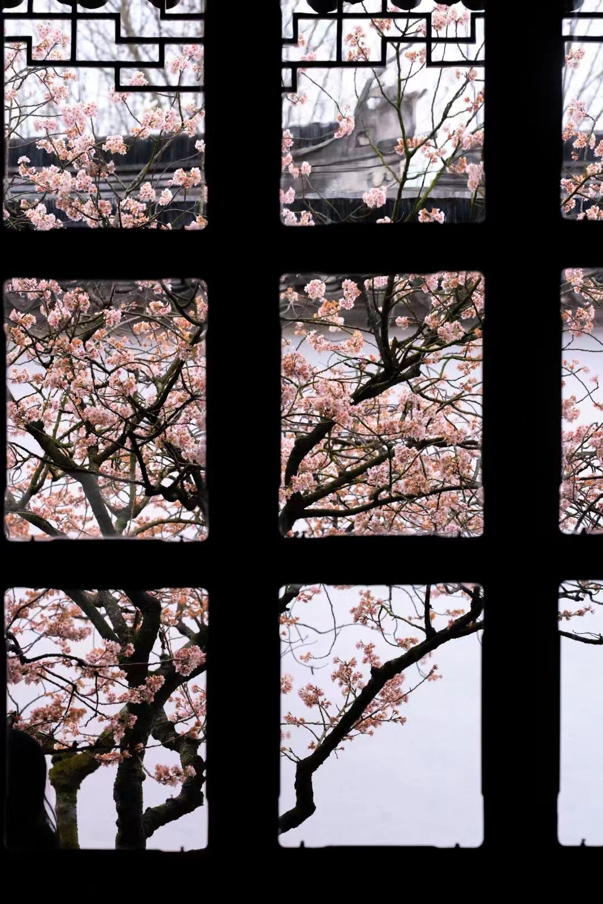

# 唐诗三百首 

---

在清蘅塘退士选编基础上增补常背诗数首，并添注校、注音。 [唐诗三百首增补PDF](https://github.com/WuShaoa/TangDynastyPoems/releases/tag/%23pdf)

带注音中国诗 Latex 环境（xpinyin）。

# 300 Tang Dynasty Poems and more, with Latex style.

Several poems by added on the basis of the selection of the scholar HengtangTuishi, in Qing dynasty. With Chinese poetry Latex environment (xpinyin) .

---
题图 by Astre.

The Flower Picture is Astre's photography, all rights reserved.

---

